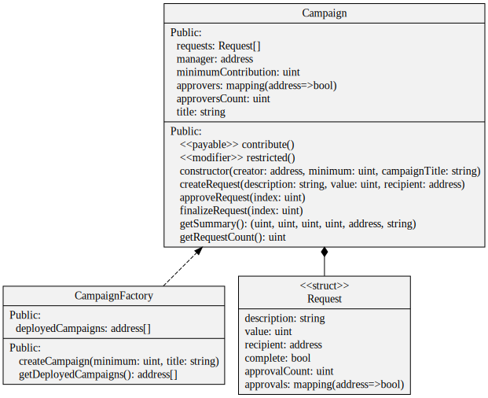

# Kickstart

Its a fork from [decentryfi/courses/kickstart](https://github.com/decentryfi/courses/tree/main/kickstart). This project is created with the propose of allowing people financing campaigns based on donators consensus, because in order to transfer funds the manager needs at least 50% of total donators approvals. This is possible thanks to Smart Contracts that are deployed on many EVM compatible networks.

The project is available on [Ethereum](https://ethereum.org/en/) but as the transactions are very expensive (at time of creating the project 8-12-2021) to make it viable we needed to deploy it on [HarmonyOne](https://www.harmony.one/) and [Polygon](https://polygon.technology/).

# Project structure

This project is structured as monorepo including both EVM compatible smart contracts and single page application created with ReactJs.

```
.
├── contracts                # Smart contracts and relevant blockchain stored
├── public                   # Website public folder used for static assets
├── src                     
│   ├── assets               # App specific assets like SASS, icons...
│   ├── components           # Generic components code for the website
│   ├── contracts-interfaces # Exported interfaces from smart contracts
│   ├── models               # Generic data models that are used across the app
│   ├── pages                # Components used as individual pages
│   └── services             # Static serices to simplify logic across the app
└── test
    ├── contracts            # Smar contract tests
    └── ui                   # Frontend tests
```
src: ```tree -d -A -I node_modules -L 2```

## Smart Contracts

The DEFI app is build out of two smart contracts and a struct:

    - CampaignFactory: used to instantiate Campaigns on blockchain, that way we exclude the possibility that someone can deploy a corrupted campaign.

    - Campaign: contains the logic that make possible to the user and manager to interact the way it was explained on upper sections.

    - Request: structure of data used to have track of the interactions with the Campaign contract.



# User Interface

The user interface implements two blockchain providers, [standard Web3](https://www.npmjs.com/package/web3) provider (read only) and [Metamask](https://www.npmjs.com/package/@metamask/detect-provider) (read and write). 

As of my experience using Angular I was influenced on service creation to isolate very specific logic e.g.create a campaign, switch network and isolate Web3 providers. As for the UI components [MaterializeCSS](https://react-materialize.github.io/react-materialize/?path=/story/*) applying the style of [DecentryFi](https://github.com/decentryfi/styleguide).